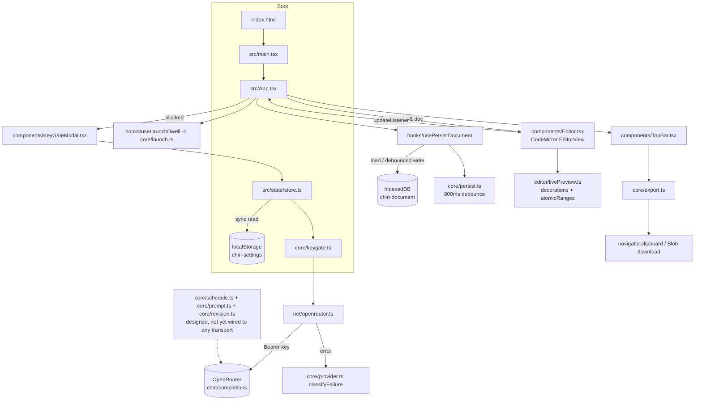
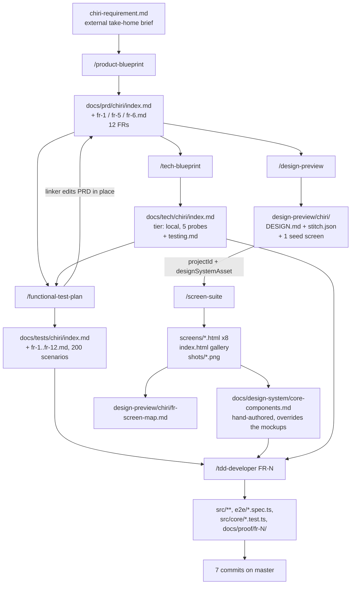

# AGENTIC_SYSTEM.md

## What this repo is

Chiri is a single-page browser app holding exactly one Markdown document, where an AI co-author works inside the document surface instead of a chat panel: ahead of the caret it predicts, behind the caret it waits to be invited.
It is client-only - no backend, no accounts, no telemetry - and the browser calls OpenRouter directly with a key the user pastes at runtime and that lives only in `localStorage`.
The seed brief is [`chiri-requirement.md`](./chiri-requirement.md), an external engineering-assessment take-home; everything under [`docs/`](./docs/) was generated from it by the agentic pipeline described below.
It is for a writer who wants an editor, not a chatbot, and for the reviewer of that assessment.

## Architecture at a glance

| Layer | Choice | Evidence |
|---|---|---|
| Build | Vite 8 + `@vitejs/plugin-react`, TypeScript 6, `strictPort: 5173` | [`vite.config.ts`](./vite.config.ts), [`package.json`](./package.json) |
| UI | React 19, Tailwind v4 via `@tailwindcss/vite` (no PostCSS, no `tailwind.config`) | [`src/index.css`](./src/index.css) |
| Editing surface | CodeMirror 6 (`state`, `view`, `commands`, `lang-markdown`, `language`) | [`src/components/Editor.tsx`](./src/components/Editor.tsx) |
| State | Zustand, one store, reached only through one module | [`src/state/store.ts`](./src/state/store.ts) |
| Persistence | `idb-keyval` (IndexedDB, key `chiri-document`) + `localStorage` (key `chiri-settings`) | [`src/storage/`](./src/storage/) |
| Network | One hand-written `fetch` to `POST https://openrouter.ai/api/v1/chat/completions` | [`src/net/openrouter.ts`](./src/net/openrouter.ts) |
| Tests | Vitest limited to `src/core/**` (20 specs); Playwright over 3 engines (55 specs) | [`vite.config.ts`](./vite.config.ts), [`playwright.config.ts`](./playwright.config.ts) |
| Lint | oxlint, with a `no-restricted-imports` override banning React/CodeMirror/Zustand/idb-keyval inside `src/core/**` | [`.oxlintrc.json`](./.oxlintrc.json) |
| CI | None. No `.github/`; every check is a local npm script | Not evidenced in repo |

The load-bearing idea is the **pure core**: [`src/core/`](./src/core/) holds the state machines (key gate, launch dwell, request scheduler, prompt assembly, revision guards, persistence debounce, export) with dependencies injected, and the purity boundary is enforced by lint rather than convention. Everything DOM-shaped lives in `components/`, `hooks/`, `editor/`, `net/`, `storage/`.



Only the key-validation probe currently reaches the network. `core/schedule.ts`, `core/prompt.ts` and `core/revision.ts` are imported exclusively by their own `*.test.ts` files.

## The agentic build system

The installer's own name is `Not evidenced in repo` - no manifest, lockfile entry, or comment references `claude-code-builder`. What is present is a self-contained package under [`.claude/`](./.claude/): 6 slash commands, 5 deterministic Workflow scripts, and 28 subagent definitions. There is **no** `.claude/settings.json`, `.claude/settings.local.json`, `.claude/CLAUDE.md`, `CLAUDE.md`, `.mcp.json`, or hooks directory in this repo.

```
.claude/
├── commands/                     # 6 slash commands; each is an orchestrator prompt that calls one Workflow
│   ├── product-blueprint.md      # expand a rough PRD into a full PRD (Agent tool, not Workflow)
│   ├── tech-blueprint.md         # PRD -> technical blueprint, with real terminal probes
│   ├── design-preview.md         # PRD -> DESIGN.md + one Stitch-rendered screen
│   ├── screen-suite.md           # PRD -> every screen, in the already-approved design system
│   ├── functional-test-plan.md   # PRD -> one natural-language test plan per FR, linked back
│   └── tdd-developer.md          # one tag -> red/green TDD cycle + browser proof
├── workflows/                    # deterministic JS orchestration; fan-out, caps, retry loops
│   ├── design-preview.js         # Read -> Direct -> Provision -> Render -> Record
│   ├── screen-suite.js           # Extract -> Plan -> Anchor -> Render -> Unify -> Gallery -> Record
│   ├── functional-test-plan.js   # Inventory -> Write (parallel) -> Link
│   ├── tech-blueprint.js         # Frame -> Design -> Probe -> Reconcile -> Author -> Critique -> Revise
│   └── tdd-developer.js          # Frame -> Red -> Verify red -> Green -> Adjudicate -> Browser -> Report
└── agents/                       # 28 subagent definitions, frontmatter: name, description, tools, model
```

Agent roster by family (all frontmatter verified):

| Family | Agents (model) |
|---|---|
| PRD | `blueprint-prd-author` (opus) |
| Tech | `tech-framer` (sonnet), `tech-designer` (opus), `stack-prober` (sonnet), `tech-doc-author` (opus), `tech-critic` (opus) |
| Design preview | `preview-scoper` (sonnet), `design-director` (sonnet), `stitch-provisioner` (sonnet), `screen-renderer` (sonnet), `preview-recorder` (haiku) |
| Screen suite | `requirement-extractor` (sonnet), `screen-planner` (sonnet), `suite-renderer` (sonnet), `suite-unifier` (sonnet), `gallery-author` (sonnet), `suite-recorder` (haiku) |
| Test plans | `test-plan-inventory` (sonnet), `test-plan-writer` (sonnet), `test-plan-linker` (sonnet) |
| TDD | `tdd-dev-framer` (opus), `tdd-dev-test-writer` (haiku), `tdd-dev-verifier` (haiku), `tdd-dev-implementer` (sonnet), `tdd-dev-adjudicator` (sonnet), `tdd-dev-e2e-author` (opus), `tdd-dev-browser-runner` (haiku), `tdd-dev-reporter` (sonnet, `tools: []`) |

Four agents deliberately omit a `tools:` key so they inherit unrestricted access and can `ToolSearch` for deferred Stitch tools: `screen-renderer`, `stitch-provisioner`, `suite-renderer`, `suite-unifier`.

## Workflow reference

### 1. `/product-blueprint`

| | |
|---|---|
| Purpose | Expand a rough PRD into an engineering-grade PRD |
| Definition | [`.claude/commands/product-blueprint.md`](./.claude/commands/product-blueprint.md) |
| Inputs | A PRD file path or inline PRD text, plus focus notes; orchestrator derives slug and `docs/prd/<slug>/` |
| Artifacts | [`docs/prd/chiri/index.md`](./docs/prd/chiri/index.md) plus promoted [`fr-1.md`](./docs/prd/chiri/fr-1.md), [`fr-5.md`](./docs/prd/chiri/fr-5.md), [`fr-6.md`](./docs/prd/chiri/fr-6.md) |
| Tools / subagents | Agent tool -> `blueprint-prd-author` (opus; `Read, Write, Edit`). The only command with **no** Workflow script |
| MCP | None |
| As run here | From `chiri-requirement.md`; produced 12 FRs (FR-1..FR-12), 3 promoted to their own files. `Owner` is filled in (`Lorenzo Tomas Diez`), not left as the placeholder the command warns about |

### 2. `/tech-blueprint`

| | |
|---|---|
| Purpose | Right-sized technical blueprint, with empirical questions settled by running them |
| Definition | [`.claude/commands/tech-blueprint.md`](./.claude/commands/tech-blueprint.md), script [`.claude/workflows/tech-blueprint.js`](./.claude/workflows/tech-blueprint.js) |
| Inputs | PRD path, optional `tier`, notes, `maxProbes` (default 4), `probeDir` |
| Artifacts | [`docs/tech/chiri/index.md`](./docs/tech/chiri/index.md), split file [`docs/tech/chiri/testing.md`](./docs/tech/chiri/testing.md), scratch in `.tech-blueprint-probes/chiri/` |
| Subagents | `tech-framer` -> `tech-designer` -> `stack-prober` (parallel per question) -> `tech-designer` (reconcile, only if a probe is `refuted`/`partial`) -> `tech-doc-author` -> 3 parallel `tech-critic` lenses (`right-sizing`, `testability`, `risk-honesty`) -> `tech-doc-author` revise, `MAX_ROUNDS = 2` |
| MCP | context7 (`resolve-library-id`, `query-docs`) declared in `tech-designer` and `stack-prober` frontmatter |
| As run here | Tier `local`. **5 probes ran against a default cap of 4** - the command documents `maxProbes: 4`, and the artifact directory carries a `probe-2-rerun`, so the count reflects at least one re-run. Verdicts: 4 `confirmed`, 1 `partial` (CM6 atomic ranges), 1 `refuted` (React state *is* readable from a CM6 ViewPlugin via `useRef`). 7 open questions carried to humans |

### 3. `/design-preview`

| | |
|---|---|
| Purpose | Judge one visual direction fast, before paying for a dozen screens |
| Definition | [`.claude/commands/design-preview.md`](./.claude/commands/design-preview.md), script [`.claude/workflows/design-preview.js`](./.claude/workflows/design-preview.js) |
| Inputs | PRD path or description, optional `| screen: <name>`, optional prior `stitch.json` manifest |
| Artifacts | [`docs/design-preview/chiri/DESIGN.md`](./docs/design-preview/chiri/DESIGN.md), [`stitch.json`](./docs/design-preview/chiri/stitch.json), and the root screen [`document-editor-mid-draft-with-live-continuation-and-a-pending-revision.html`](./docs/design-preview/chiri/document-editor-mid-draft-with-live-continuation-and-a-pending-revision.html) |
| Subagents | `preview-scoper` (sonnet) -> `design-director` (sonnet) -> `stitch-provisioner` (sonnet) -> `screen-renderer` (sonnet) -> `preview-recorder` (haiku, `effort: low`). Direct and Provision are skipped when a manifest is reused |
| MCP | Stitch: `create_project`, `create_design_system`, `update_design_system`, `generate_screen_from_text`, `get_screen` |
| As run here | Created project `5093882949210672317` and design system `assets/14629870475207804554`, `deviceType: DESKTOP`. The human added a direction constraint recorded verbatim in `stitch.json`'s `prd` field: strictly monochrome, Apple-spirited |

### 4. `/screen-suite`

| | |
|---|---|
| Purpose | Render every screen the PRD calls for, in the already-approved system |
| Definition | [`.claude/commands/screen-suite.md`](./.claude/commands/screen-suite.md), script [`.claude/workflows/screen-suite.js`](./.claude/workflows/screen-suite.js) |
| Inputs | PRD folder, the parsed `stitch.json`; hard-fails without `projectId` + `designSystemAsset` |
| Artifacts | 8 files in [`docs/design-preview/chiri/screens/`](./docs/design-preview/chiri/screens/), gallery [`index.html`](./docs/design-preview/chiri/index.html), 10 PNGs in `shots/`, merged `stitch.json` |
| Subagents | `requirement-extractor` -> `screen-planner` -> `suite-renderer` (one anchor screen alone, then batched parallel at `BATCH_SIZE = 3`) -> `suite-unifier` -> `gallery-author` -> `suite-recorder`. Cap `maxScreens` default 10, overflow dropped by importance rank |
| MCP | Stitch: `generate_screen_from_text`, `get_screen`, `edit_screens`, `list_screens` |
| As run here | 12 FRs became 8 screens, all `rendered`. FR-4 and FR-10 got no screen by design. Two artifacts here are **not produced by any command in `.claude/commands/`**: [`docs/design-preview/chiri/fr-screen-map.md`](./docs/design-preview/chiri/fr-screen-map.md) and the 10 `shots/*.png` |

### 5. `/functional-test-plan`

| | |
|---|---|
| Purpose | One natural-language test plan per FR, written in parallel, linked back into the PRD |
| Definition | [`.claude/commands/functional-test-plan.md`](./.claude/commands/functional-test-plan.md), script [`.claude/workflows/functional-test-plan.js`](./.claude/workflows/functional-test-plan.js) |
| Inputs | PRD path, optional blueprint path, `only` filter, `maxRequirements` (default 20), date |
| Artifacts | [`docs/tests/chiri/index.md`](./docs/tests/chiri/index.md) plus `fr-1.md` .. `fr-12.md`; edits the PRD in place to inject `Tests:` links |
| Subagents | `test-plan-inventory` (sonnet, `effort: low`) -> `test-plan-writer` fanned out one per requirement, unbatched -> `test-plan-linker` (single, to avoid concurrent edits) |
| MCP | None |
| As run here | 12 requirements, 12 plans, **200 scenarios**, 39 open questions, `Requirements with no plan: None`. Back-links land in two places: 9 in `docs/prd/chiri/index.md`, 3 in the promoted `fr-N.md` header tables |

### 6. `/tdd-developer`

| | |
|---|---|
| Purpose | Take one tagged requirement through a real red/green cycle and prove it in a browser |
| Definition | [`.claude/commands/tdd-developer.md`](./.claude/commands/tdd-developer.md), script [`.claude/workflows/tdd-developer.js`](./.claude/workflows/tdd-developer.js) |
| Inputs | An FR id, a test-plan path, or free text; `maxTests` default 8, `skipBrowser`, `proofDir` |
| Artifacts | Test files at framer-assigned paths, production source, screenshots under `docs/proof/<slug>/`. The report is returned as text and **saved nowhere** |
| Subagents | `tdd-dev-framer` (opus) -> `tdd-dev-test-writer` (haiku, parallel per test) -> `tdd-dev-verifier` (haiku) -> `tdd-dev-implementer` (sonnet, single by design) -> loop: `tdd-dev-verifier` + parallel `tdd-dev-adjudicator` + `tdd-dev-test-writer` upgraded to **sonnet** for corrections, `MAX_ATTEMPTS = 2` -> `tdd-dev-browser-runner` preflight -> `tdd-dev-e2e-author` (opus) -> `tdd-dev-browser-runner` -> `tdd-dev-reporter` |
| MCP | None. The browser runner shells out to `playwright-cli` (scratch in [`.playwright-cli/`](./.playwright-cli/)) |
| As run here | Proof folders exist for only two runs: [`docs/proof/fr-2/`](./docs/proof/fr-2/) (5 shots) and [`docs/proof/fr-8/`](./docs/proof/fr-8/) (7 shots). 55 Playwright specs and 20 Vitest specs exist across FR-2, 3, 4, 6, 8, 9 and the key gate, so most runs left no proof folder |

## MCP layer

No MCP server is configured **inside this repo**: there is no `.mcp.json` and no `settings.json` with an `mcpServers` block. Both servers below are resolved from user-level configuration, so their credentials and transport are `Not evidenced in repo`. Two servers are referenced by name from agent definitions.

### Google Stitch (`mcp__stitch__*`)

Provides project creation, a design-system asset (color seed, mode, font pairing, roundness, device type), text-to-screen generation, multi-screen editing, and markup retrieval. It is the only paid, stateful external service in the pipeline, and its state is checkpointed into a repo file so a later run can attach to it rather than duplicate it.

| Agent | ToolSearch selector, verbatim | Used by |
|---|---|---|
| [`stitch-provisioner.md`](./.claude/agents/stitch-provisioner.md) | `select:mcp__stitch__create_project,mcp__stitch__create_design_system,mcp__stitch__update_design_system` | `/design-preview` |
| [`screen-renderer.md`](./.claude/agents/screen-renderer.md) | `select:mcp__stitch__generate_screen_from_text,mcp__stitch__get_screen` | `/design-preview` |
| [`suite-renderer.md`](./.claude/agents/suite-renderer.md) | `select:mcp__stitch__generate_screen_from_text,mcp__stitch__get_screen` | `/screen-suite` |
| [`suite-unifier.md`](./.claude/agents/suite-unifier.md) | `select:mcp__stitch__edit_screens,mcp__stitch__get_screen,mcp__stitch__list_screens` | `/screen-suite` |

All four carry the same warning: Stitch tools are deferred, so absence from the visible tool list is not evidence they are missing, and no agent may report Stitch unreachable without a `ToolSearch` call that came back empty.

The handoff between the two Stitch commands is [`docs/design-preview/chiri/stitch.json`](./docs/design-preview/chiri/stitch.json):

```json
{
  "slug": "chiri",
  "productName": "Chiri",
  "projectId": "5093882949210672317",
  "designSystemAsset": "assets/14629870475207804554",
  "deviceType": "DESKTOP",
  "designMd": "DESIGN.md"
}
```

Design artifacts in this repo that came from Stitch:

| Artifact | Origin |
|---|---|
| `document-editor-mid-draft-with-live-continuation-and-a-pending-revision.html` (repo root of `design-preview/chiri/`) | The `/design-preview` seed screen, screen id `c70a0537...`. It has no `key` or `frIds` and the gallery does not link it |
| `screens/launch-splash.html` (FR-2), `api-key-gate.html` (FR-1), `onboarding-empty-document.html` (FR-3, FR-11), `editor-continuation.html` (FR-3, FR-5, FR-10), `editor-revision-diff.html` (FR-6, FR-7), `model-selector-open.html` (FR-8), `export-menu.html` (FR-9), `revision-failure-state.html` (FR-12) | `/screen-suite`, all `status: rendered`, all reconciled by one `edit_screens` unify pass |
| `DESIGN.md` | `design-director`, not Stitch. Tokens: seed `#1D1D1F`, mode LIGHT, single family Inter, 8px radius, hairline borders instead of shadows, no accent hue |
| `index.html`, `shots/*.png` | `gallery-author` and a screenshot pass respectively |

[`docs/design-system/core-components.md`](./docs/design-system/core-components.md) (39 KB) is hand-authored downstream of Stitch, not generated by it. It explicitly instructs implementers to take the measurements but not the markup, because the rendered files are Tailwind-CDN prototypes that disagree with one another, and it overrides them where they conflict (for example rejecting the `Public Sans` label font that every Stitch file used, in favour of Inter alone). It adds concrete tokens that `DESIGN.md` did not name: Paper `#FDF8F8`, Muted ink `#46464A`, Hairline `#C7C6CA`, Error `#BA1A1A`.

### context7 (`mcp__plugin_context7_context7__*`)

Provides up-to-date library documentation. Declared in the `tools:` frontmatter of [`tech-designer.md`](./.claude/agents/tech-designer.md) and [`stack-prober.md`](./.claude/agents/stack-prober.md), both used only by `/tech-blueprint`, with tools `resolve-library-id` and `query-docs`. This is how the blueprint pins exact versions (CodeMirror 6.43.7, Vite 8.1.5, Zustand 5.0.14) rather than guessing.

## Pipeline trace



Where iteration actually happened, from git history:

| Commit | What it shows |
|---|---|
| `3b13e7b` Scaffold Chiri | The blueprint's stack landing as real code, plus the FR-10 scheduler |
| `1dcbfd0` Map functional requirements to design screens, fix splash logo render | The `fr-screen-map.md` pass, folded together with a rendering fix |
| `68e3053` Fix tests that were green by breaking the product | The adjudication loop's failure mode surfacing in a human commit: tests had been made to pass by regressing behavior |
| `5505e01` Anchor the model dropdown to its trigger, not the viewport gutter | A design-fidelity correction against `core-components.md`, not a test failure |
| `7786c5f` Implement the FR-1 key gate and build it to CC-GATE | A `/tdd-developer` run that took its acceptance criteria from the core-components document (`CC-GATE`), not from the test plan |
| `fdadffd`, `773193c` | FR-2 launch splash and FR-8 model selector, each with its `docs/proof/` folder |

Iteration is concentrated in two places: `/tech-blueprint`'s probe phase, where probe 5 **refuted** a design assumption before anything was built on it, and the TDD adjudication loop, whose weakest point (`68e3053`) needed a human to catch.

## Running it yourself

Prerequisites: Node 26.x tooling, Claude Code with the Stitch and context7 MCP servers configured at user or project level, and `playwright-cli` on PATH for the browser-proof phase.

```sh
# 0. Prerequisites
git init && npm init -y
npx playwright install
# Stitch MCP: configure at user level, or add a project-level .mcp.json.
# The exact server command, transport, and auth are Not evidenced in repo.

# 1. Copy the agentic package
cp -R /path/to/chiri/.claude .claude    # commands/, workflows/, agents/

# 2. Run the pipeline, in order
/product-blueprint ./chiri-requirement.md
/tech-blueprint docs/prd/chiri/ local
/design-preview docs/prd/chiri/index.md
#    look at the HTML, say yes or no, then:
/screen-suite docs/prd/chiri/
/functional-test-plan docs/prd/chiri/ docs/tech/chiri/index.md
/tdd-developer FR-1      # repeat per requirement
```

Notes that matter: `/screen-suite` refuses to run without `docs/design-preview/<slug>/stitch.json`; `/tech-blueprint` gives agents a real terminal and writes scratch into `.tech-blueprint-probes/<slug>/`; `/functional-test-plan` edits the PRD, so commit first; `/tdd-developer` writes production code, so a clean tree makes `git diff` the review.

## Gaps and open questions

| Gap | Detail |
|---|---|
| Installer unidentified | Nothing in the repo names `claude-code-builder`. There is no `.claude/settings.json`, `settings.local.json`, `CLAUDE.md`, `.mcp.json`, or hooks configuration |
| MCP config is external | Stitch and context7 are referenced by agent files but configured outside the repo; auth, endpoint, and credentials are `Not evidenced in repo`. `.env.example` documents only `OPENROUTER_API_KEY`, which is for blueprint probe scripts, not for MCP |
| Two artifacts have no producing command | `docs/design-preview/chiri/fr-screen-map.md` and `docs/design-preview/chiri/shots/*.png` are not written by any of the 5 workflow scripts |
| README is stale | It says persistence, the key gate, live preview and the model selector are "not built yet"; all four exist in `src/` |
| PRD implementation column is stale | FR-4, FR-6 and FR-9 are marked "Not started" while `e2e/fr-4-*`, `fr-6-*` and `fr-9-*` specs and `src/core/persist.ts`, `revision.ts`, `export.ts` all exist |
| Proof coverage is partial | Only FR-2 and FR-8 have `docs/proof/` folders despite six FRs having e2e specs. The reporter saves nothing to disk, so earlier runs left no record |
| Probe count exceeds the documented cap | The command documents `maxProbes: 4`; the blueprint reports 5 probes and the scratch dir holds a `probe-2-rerun` |
| Playwright retries never fire | `trace: 'on-first-retry'` is set but `retries` is not, so it defaults to 0 and traces are never captured |
| Leftover files | `e2e/zzz-debug-caret.spec.ts` is a debug spec still in the suite; `src/assets/react.svg`, `vite.svg`, `hero.png` are unused scaffold; `@floating-ui/react` and `diff` are declared dependencies with no importer |
| Core designed but unwired | `core/schedule.ts`, `core/prompt.ts`, `core/revision.ts` are imported only by their own tests, so FR-5/FR-6/FR-7 have unit coverage and no runtime path |
| `core/export.ts` untested at unit level | Its own docstring calls it the pure FR-9 seam, but coverage is e2e-only |
| TypeScript `strict` is off | `tsconfig.app.json` does not set `strict`, which the blueprint does not discuss |
| 39 open questions unanswered | `docs/tests/chiri/index.md` carries 39 PRD ambiguities and `docs/tech/chiri/index.md` carries 7 more; the commands warn that unanswered questions get resolved silently by whoever codes first |
