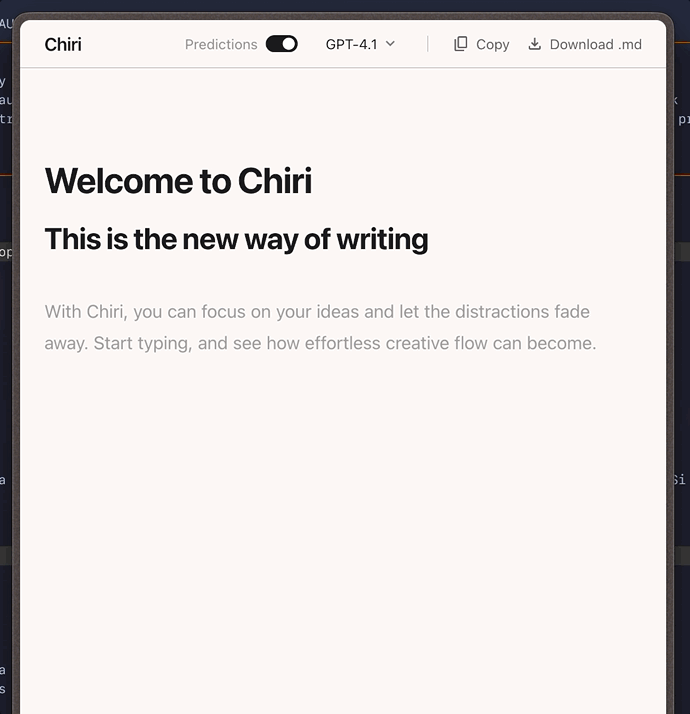
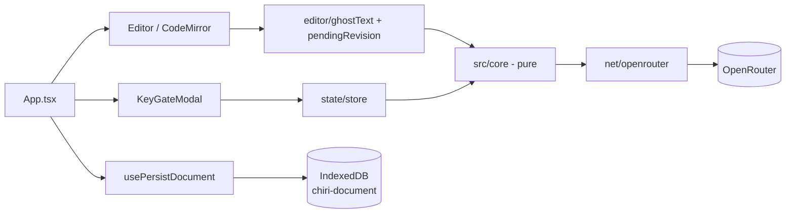

# Chiri

A single-document Markdown editor with an AI co-author that lives in the page, not a chat panel.

Writing tools put the AI in a sidebar, so you copy text out, prompt it, and paste the result back.
Chiri puts it in the document: ahead of the caret it predicts, behind the caret it waits to be invited.
It is client-only - no backend, no accounts, no telemetry - and your browser calls OpenRouter directly with a key you paste at runtime and that never leaves `localStorage`.



## Built by an agentic pipeline

Every document under [`docs/`](./docs/) was generated from one seed brief, [`chiri-requirement.md`](./chiri-requirement.md), by a pipeline of 6 slash commands, 5 deterministic workflow scripts, and 28 subagent definitions living in [`.claude/`](./.claude/).
`/product-blueprint` turned the brief into a 12-requirement PRD.
`/tech-blueprint` picked the stack and settled 5 open questions by actually running them in a terminal - one probe refuted a design assumption before any code depended on it.
`/design-preview` and `/screen-suite` used the Google Stitch MCP as the design backbone: one seed screen to judge the direction, then 8 screens rendered into that same design system and unified in a single pass.
`/functional-test-plan` wrote 200 natural-language scenarios, one plan per requirement, and linked each back into the PRD.
`/tdd-developer` then took requirements through a real red/green cycle with browser proof - including the run where a human had to catch tests that passed by regressing the product.

**[Read the full teardown in `AGENTIC_SYSTEM.md`](./AGENTIC_SYSTEM.md)** - every command, agent model, MCP call, artifact, and the gaps the pipeline left behind.

## Features

- **Inline continuation.** Grey ghost text after a pause; `Tab` takes the whole thing, `Ctrl/Cmd+Right` takes one word. The ghost is a CodeMirror decoration, never document text, until you accept it.
- **Selection-triggered revisions.** Select a span, choose Improve the writing, Make it shorter, Change the tone, or Fix grammar and spelling, or type your own instruction. The proposal renders as a diff card with a reason line and commits only on Accept - as one undo unit.
- **Refine in place.** Keep giving instructions to a pending revision; the full instruction chain rides along each turn, and a failed turn reverts to the last good proposal.
- **Request discipline.** A debounced, single-in-flight scheduler with staleness checks, plus a Predictions toggle that stops requests outright.
- **Local persistence.** The document and caret write to IndexedDB behind an 800 ms debounce and restore on reload; a corrupted record opens an empty document instead of crashing.
- **Byte-identical export.** Copy and Download both run the same pure `toExportText`, with the filename derived from your first Markdown heading.
- **Curated model selector.** Three OpenRouter models with capability notes, persisted, with a stale selection falling back to the default rather than breaking a request.

## Quickstart

Prerequisites: Node 26.x, npm 11.x, and an [OpenRouter](https://openrouter.ai) API key.

```sh
git clone <this repo> chiri && cd chiri
npm install
npm run dev          # http://localhost:5173 (strictPort - a busy 5173 fails loudly)
```

Paste your OpenRouter key into the gate on first launch. That is the whole setup.

| Variable | Required | Purpose | Example |
|---|---|---|---|
| `OPENROUTER_API_KEY` | Optional | `.env` only, for tech-blueprint probe scripts. The app never reads it. | `sk-or-v1-...` |

The app's own key is entered at runtime and stored under `localStorage` key `chiri-settings`. It is sent to exactly one destination: `POST https://openrouter.ai/api/v1/chat/completions`.

## Architecture

React 19 + CodeMirror 6 on Vite 8, with one Zustand store reached through a single module.
The load-bearing idea is `src/core/`: pure state machines - key gate, scheduler, prompt assembly, revision guards, refinement, persistence debounce, export - with every dependency injected.
Purity is enforced by an oxlint `no-restricted-imports` rule that bans React, CodeMirror, Zustand, and idb-keyval inside `src/core/**`, which is what lets the whole scheduler be asserted in virtual time with nothing running.
Depth lives in [`AGENTIC_SYSTEM.md`](./AGENTIC_SYSTEM.md) and the [technical blueprint](./docs/tech/chiri/index.md).



## Project structure

```
src/
├── core/          pure state machines, no DOM/network/framework - lint-enforced
├── components/    Editor, TopBar, KeyGateModal, ModelSelector, SelectionActionBar
├── editor/        CodeMirror extensions: ghost text, pending revision, live preview
├── hooks/         launch dwell, launch key buffer, document persistence
├── net/           the single hand-written fetch to OpenRouter
├── state/         one Zustand store
└── storage/       IndexedDB document, localStorage settings
e2e/               85 Playwright specs, named by requirement
docs/
├── prd/           the generated PRD, 12 functional requirements
├── tech/          technical blueprint and testing seams
├── tests/         200 natural-language test scenarios, one file per FR
├── design-system/ hand-authored component spec that overrides the mockups
├── design-preview/ Stitch-rendered screens, gallery, and stitch.json manifest
└── proof/         browser screenshots from /tdd-developer runs
.claude/           6 commands, 5 workflow scripts, 28 agents
```

## Testing

```sh
npm run test       # Vitest - 30 specs, src/core/** only
npm run e2e        # Playwright - 85 specs across Chromium, Firefox, WebKit
npm run lint       # oxlint, including the src/core purity rule
npm run typecheck
```

Vitest covers `src/core/**` and nothing else: probe 4 established that CodeMirror boots under jsdom only with hand-written polyfills and still has no layout engine, so coordinate and keybinding assertions would be false confidence there.
Anything touching an `EditorView` runs in a real browser.
The natural-language test plans those specs were written against live in [`docs/tests/chiri/`](./docs/tests/chiri/), one file per requirement, indexed in [`index.md`](./docs/tests/chiri/index.md).

## Contributing

- Branch from `main` as `fr-<n>-<short-slug>` or `fix-<short-slug>`.
- Run `npm run lint && npm run typecheck && npm run test && npm run e2e` before opening a PR. All four must pass.
- New features are expected to go through `/tdd-developer <FR-id>`: tests first, then implementation, then browser proof into `docs/proof/`.
- Commit with a clean tree so `git diff` is the review.
- If you change behavior a test plan covers, update the plan in `docs/tests/chiri/` in the same PR.

## License

TODO: choose a license. No `LICENSE` file exists in this repo.
